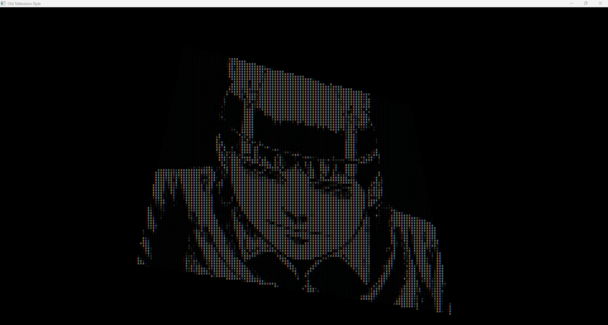
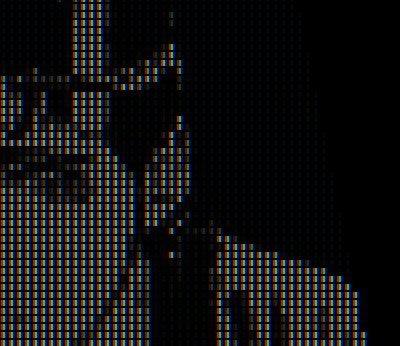

# Old Tellevision Effect Shader

## Description

A small program for rendering, emulating old televisions with large pixels.

## Installation

After cloning the repository, you will need to download the following libraries:
 - [GLFW](https://www.glfw.org/download.html)
 - [GLEW](https://glew.sourceforge.net/)
 - [GLM](https://github.com/g-truc/glm.git)

Then in the .vscode/tasks.json file you will need to change the path to these dependencies. If you are not working in Visual Studio Code, then you will have to configure all dependencies yourself according to your environment.

I use the static versions of these libraries, to use the dynamic ones you will need to read the guide to these libraries yourself :\).

#### Warning
I'm on Windows and I'm using the msvc compiler, so in order for VS code to be able to access that compiler you'll need to do the following:
1. Open Developer Command Prompt:
 - Search for "Developer Command Prompt for Visual Studio" in the Start menu.
 - Open the Developer Command Prompt. This environment is configured with paths and environment variables necessary for using the MSVC compiler.

2. Navigate to Your Project Directory:
 - In the Developer Command Prompt, use the cd command to change to your project directory. For example:
```bash
cd path\to\your\project
```

3. Launch Visual Studio Code:
 - While still in the Developer Command Prompt and inside your project directory, type the following command to open Visual Studio Code:
```bash
code .
```
This command will launch Visual Studio Code with the current directory set as the workspace, allowing you to access and edit your project files.

## Usage

##### How to Compile and Run the Project:
1. Open Command Palette:
 - In Visual Studio Code, press Ctrl + Shift + P to open the Command Palette.

2. Run Build Task:
 - Type Run Task in the Command Palette search box.
 - Select Run Task from the list of options.
 - Choose Build_x86 from the list of available tasks to start the build process.

3. Check Build Output:
 - Ensure that the build is successful and there are no errors in the output.

4. Run the Program:
 - Open a terminal and execute the following command:
```bash
./bin/old_tv_effect.exe "path\to\your\photo" scale
```
scale is a value multiple of 4 (4, 8, 12, 16 ...). If you write 1, the effect will not be applied.

This will launch the compiled executable.

You can rotate your image. For this use WASD buttons. 
For scaling use scroll.


## Screenshots


